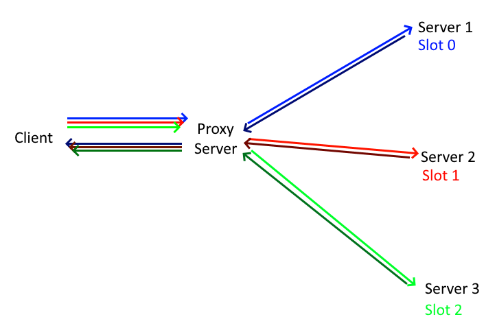

# DSU Multiplayer Proxy

A DSU Proxy server for emulator motion controls netplay. 

Allows multiple DSU servers (possibly across the internet) to act as a single DSU server, each being assigned a separate controller slot.

~~1000 hours in mspaint~~

### Usage

 1. Enter the IP address of each remote server in the Client box. 
 * Up to four remote servers can be connected to at once.
 2. Press the "Connect" button to establish a connection with the remote server
 * The order in which you connect the servers is the number of each player
 4. Once all the server are connected, start the local server
 5. Done!

### About

I threw this together in like 10 hours so it's a bit rough around the edges. Currently it only supports IP addresses (no domain names), doesn't support MAC address based selection, doesn't allow changing slot assignment, and the proxy server modifies all requests to remote servers to use slot 0.

Also the code is kinda sloppy. I'll eventually get around to making it a bit more pretty (famous last words).